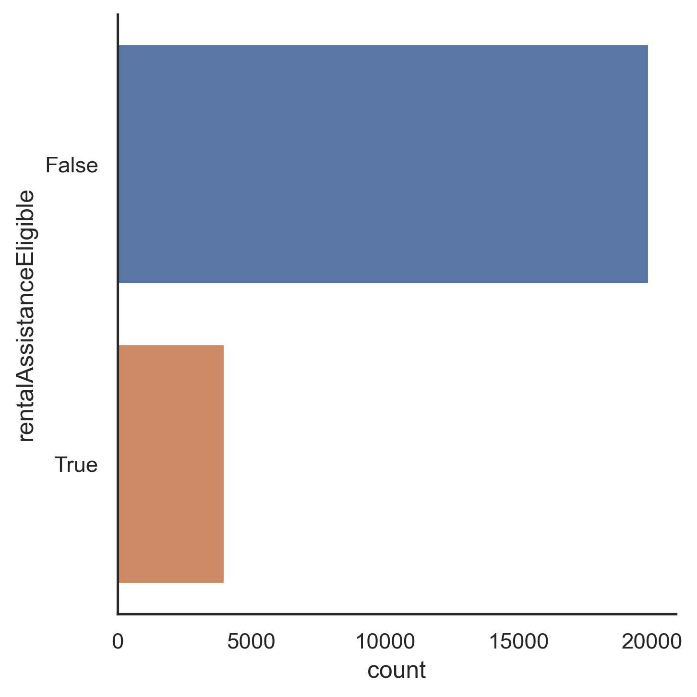

# hurricaine_irma_femaassistance_dev

OVERVIEW:

This project aims to understand the demographics and characteristics of 
applicants for FEMA Individual Assistance Housing Registrants following 
Hurricane Irma in 2017 in Miami. The analysis is split into three parts:
downloading the original data from FEMA via an API call (frame.py script), 
creating visuals that help the reader understand certain housing 
characteristics of applicants (visuals.py), and then mapping each zip code in a
heat map by certain demographics (geo.py). In all, the analysis provides
insight to the geographic concentration of FEMA Individual Assistance Housing 
Registrants by applicatation volume, median income, and population density, and
concludes that the majority of applicants following Hurricane Irma are 
low-income renters in 1 individual residences and in highly populated zip 
codes.

INPUT FILES: 

There are 2 sets of input data that were obtained for this analysis, and 
both were obtained via API call. First, the FEMA Individual Assistance 
Housing Registrants data was obtained through an API call using FEMA 
specific keys and values. For more keys and values, the user can look on the 
FEMA open data website tab 'Developer Resources'. The script frame.py in this 
repository outlines how the call was constructed. Since the FEMA dataset 
includes records from multiple natural disasters (totaling at 6,367,304 
records) with 41 different data fieds, the call trimmed down the dataset for 
analysis signficantly. The total number of records that were Huricane Irma 
specific totals 352,244 records. Since FEMA only allows 1,000 records to be 
called at a time through the API, the frame.py script includes a for loop to 
obtain all 352,244 records. The FEMA API call requested only records from 
disaster number 4337 (Hurricane Irma) and disaster city Miami. The call also 
requested only 5 data fields: damaged zip code (where the damaged residence 
is), if the applicant was an owner or renter, the residence type of the damaged
property, the household composition of the damaged property, the self reported 
gross income of the applicant, and if the applicant was eligible for renter 
assistance. 

The second input dataset was obtained from the census via API call in the 
geo.py script. The dataset is from the 2019 American Community Survey, 
and the call for this analysis only requested the total population count and 
median income of zip codes in the State of Florida. This data was then 
merged onto the FEMA data. Finally, the last input file is a shapefile by 
county of the entire state of Florida, downloaded from the Census website. 
The input file was then trimmed down to just Miami Dade and Broward County, 
because the FEMA data included residences in both counties. Once the shapefile
was trimmed, the previous population data was merged onto the shapefile, 
and written out to a geopackage for further mapping in GIS. 

SCRIPT BREAKDOWN: 

1. frame.py
The first script to run is the 'frame.py' script. This script retrieves 
the input data that is essential for the analysis. The format of this API 
call is easy to play with, so if a future user is interested in a different 
disaster or a different city, they can easily enter the respective disaster
code and city name and perform a similar analysis. Once all of the data for 
the Hurricane Irma applicants in Miami, it is written to one large csv file 
called 'irma.csv' which is used for the next script of the analysis. 

2. visuals.py
The second script to run is the 'visuals.py' script. This script takes the 
'irma.csv' file and produces visual overviews of data fields within the 
file using seaborn. First, the script counts the number of applicants 
in each zip code within the 'irma.csv' file and writes the result out to 
a new csv file called 'Count_by_Zip.csv'. Then, the script narrows down the 
'irma.csv' file to just the 5 zip codes with the highest number of applicants.
This data is written out to a csv file 'Top_5_Zips.csv'.
Then, using seaborn, the script runs through each of the data fields retrieved 
in 'frame.py' in the 'Top_5_Zips.csv' file and graphs them on a catplot. This 
gives a general visual overview of certain housing characteristics of the data
in the top 5 Zip Codes. 

Then, the script graphs a violin plot showing the household composition 
across the top 5 zip codes, with a hue of owner or renter. This violin plot 
shows that the most popular applicant household composition is a 1 person 
household, and that there are more renters across the board than owners. 

Next, the script filters down the data of the top 5 Zip Codes to applicants 
who are renters, and whose residence is either an Apartment, House/Duplex, 
or Townhouse because those are the 3 most common residences in the dataset.
With this filtered data, the script then plots a countplot of residence 
type across each of the top 5 zip codes. There are variations per zip code, 
but it is clear that the three metro-Miami zip codes (blue, orange, and green)
mostly consist of apartments and house/duplex. Furthermore, it looks like the 
majority of the applications in the top 5 zip codes are in these 3 zip codes.

Next, I was curious how the plots would change if only looking at low income 
renter applicants. So, the script then filters down the top 5 zip code 
data to applicants who were renters with a self reported gross income that was 
less than or equal to the median income of the data set. Then, the script 
follows the same two graphs but using this data instead. Across all 5 zip 
codes, you can see the violin plot squishing down, with even more applicants
being in 1 person households, and next to none in 4-6 person households. The 
number of renters also increases in 1-2 person households. 

The residence type across the 5 zip codes for low income renters barely changes
in the metro-Miami zip codes (blue, orange, and green) which may mean 
that the majority of applicants in these zip codes are low income renters. The
most variation in this graph is seen in the red and purple zip codes. Roughly 
half the applicants in these zip codes are low income renters, whereas in the 
metro zip codes more than 2/3 are low income renters. 

Finally, after seeing these results I was curious how many of the low income
renter applicants were eligible for renter assistane from FEMA. The script 
then graphs a catplot counting the number of records in the low income 
renter data that were eligible for rental assistance. As you can see below, 
the majority of applicants were not eligible. 

3. geo.py
Taking what I learned from the visuals script, the final script maps 
FEMA Individual Assistance Housing Registrant application 
volume, and total population, and income disparity by zip code in Miami Dade
and Broward Counties. After seeing the images from the visuals script, I 
understood that the majority of applicants were in the center city Miami area,
and were low income. In order to confirm this understanding and further it in 
GIS, this script merges the 'Count_by_Zip.csv' data onto a shapefile of all 
zip codes in the US from the census website ('cb_2019_us_zcta510_500k.zip'). 

Then, the script requests census population data from the 2019 American 
Community Survey (population count per zip code and median income in Florida) 
via a census API call and writes it to a csv 'pop_by_zip.csv'. Then, this 
file is merged onto the zip code shapefile. Finally, the script reads a 
new Florida county shapefile from the census, called 'tl_2019_us_county.zip',
and filters down the shapefile to just the zip codes of Miami-Dade and Broward.
Finally, the script clips the Irma, Zip Code, and Population data by 
the county data and writes it out to a geopackage to be used in GIS. 

4. GIS 
Finally, I generated three heat maps: by FEMA applicant volume, by median 
income, and by population count. The maps are displayed below. 

Heat Map by Applicant Count 

Heat Map by Median Income 

Heat Map by Population Density 

After viewing the heat maps, it appears that the FEMA applicant map count and 
the median income map are inverses of eachother. This would support the 
observation made through the changes in the Household Composition and 
Residence Type images once the script filtered the dataset down to low-income 
renters only. From this analysis, we can conclude that the majority of 
applicants for FEMA Individual Assistance Housing Registrants in Miami-Dade
and Broward counties following Hurricane Irma were low income applicants. 
Analysis that builds off this project could look into why the majority of these
applicants were not eligible for rental assistance, how many received 
assistance, and use other demographic data to understand what are the 
barriers for this subset of applicants to receiving FEMA assistance. It would
be relatively easy to use this script to compare the applicant breakdown of
otehr disasters and cities to see if there is a trend in socioeconomic 
barriers to receiving FEMA assistance. 

